# 如何在Macbook上把Ubuntu安装到移动硬盘里

### 温馨提示：

装机有风险，请务必先把电脑里面的重要资料备份好。我用的是Apple自带的Time Machine。插入大容量储存设备（例如250G以上的U盘或者移动硬盘）时，系统会弹出“是否用此设备备份Time machine”的提示信息，按照上面的提示操作即可。读者也可以按照自己习惯的方式备份，但记住，一定要先备份资料！！

笔者安装的时候参考了网络上许多不同的教程，失败了很多次，最后主要是根据Floris van Breugel的教程成功安装了（感谢大神），原教程在[这里](https://florisvanbreugel.wordpress.com/2018/03/23/installing-ubuntu-on-an-external-ssd-drive-on-a-macbook/)，感兴趣的朋友可以自己点开来看。本教程在原教程的基础上，按照我碰到的其它问题稍作修改。

## 你需要的工具

1. 一台有至少两个USB接口的Macbook（没有的话可以用USB hub也可以）；
2. 一个2G以上空白的可以用来烧录Ubuntu镜像的USB【下文称为USB】；
3. 一个空白的固态硬盘（Solid State Drive）【下文称为移动硬盘】。关于SSD和HDD的区别，请参考[这里](https://www.crucial.in/articles/about-ssd/ssd-vs-hdd#:~:text=The%20difference%20between%20hard%20drives,to%20store%20and%20retrieve%20data.&text=HDDs%20are%20cheaper%20and%20you,durable%2C%20and%20use%20less%20energy.)。简单来说，SSD读写速度比较快，比较可靠，但比较贵。如果你家有不要的旧电脑，也可以把里面的硬盘拆下来用。

注意2和3必须是两个不一样的设备，不可以是一个设备里面的不同分区，不然安装Ubuntu的时候会提示分区失败。

## 主要步骤

在Macbook上把Ubuntu安装到移动硬盘里主要分为以下三个步骤：

1. 前期准备：格式化移动硬盘和制作烧录了Ubuntu镜像的USB
2. 安装Ubuntu到移动硬盘上
3. 设置开机启动项（让Ubuntu可以在开机时出现）

话不多说，我们开始吧！

## 【1】前期准备

### 【1.1】格式化移动硬盘

1. 插入移动硬盘，然后打开Disk Utility

   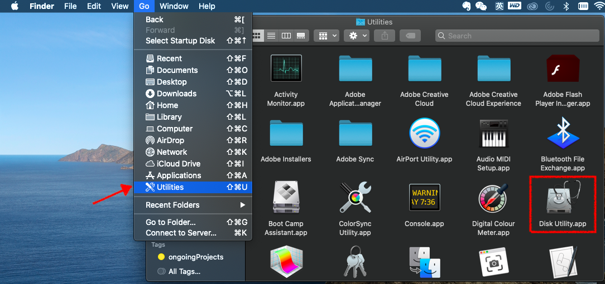

   

2. 选择新插入的移动硬盘（千万不要选错了你Macbook的硬盘）

   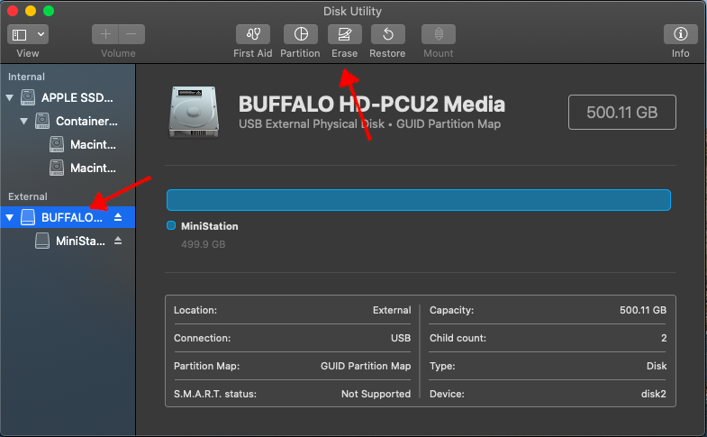

   

3. 点击Erase，并按照图中设置选项：

   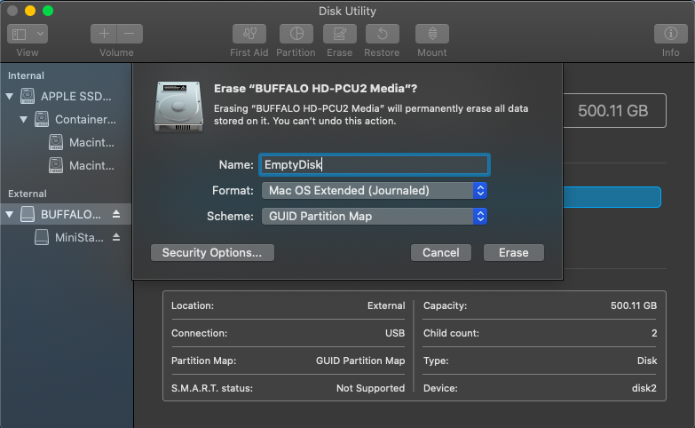

   

   

4. 再次选中你的移动硬盘，点击**Partition**。按照图中的设置划分一个128MB以上的区域作为Ubuntu的boot loader。在这里我设置了256MB的空间：

   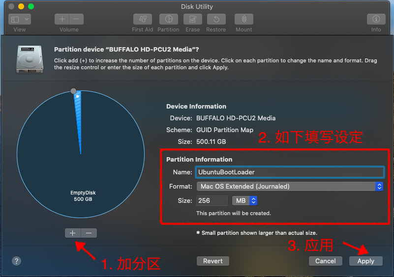

   

5. 点击**Apply**，然后点击**Partition**。

   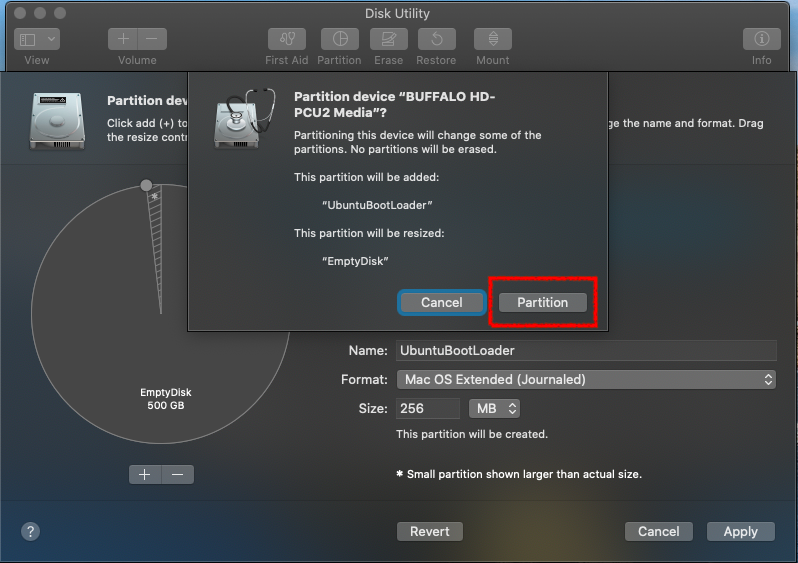

   

6. 完成后是下图这个样子的，有两个分区，分别是EmptyDisk和UbuntuBootLoader。我们将把系统装在EmptyDisk里面（见步骤【2】），留出UbuntuBootLoader安装开机启动项（见步骤【3】）。

   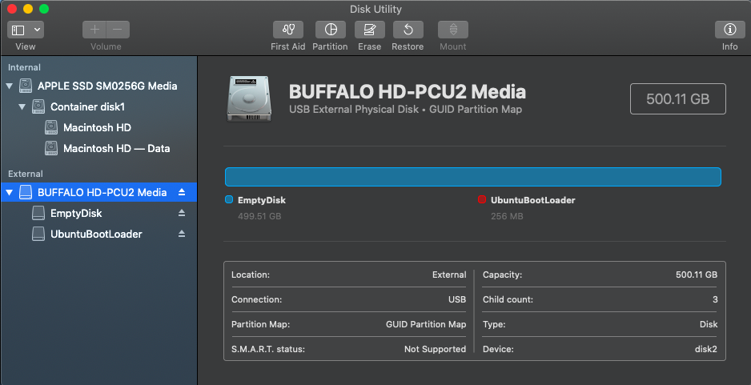

   

7. 弹出移动硬盘并从Mac中拔出。【1.1】完成。

### 【1.2】制作ubuntu安装USB

1. 插入USB

2. 下载[Ubuntu镜像](https://ubuntu.com/download/desktop)（官网上是新的20.04，我装的是16.04LTS版，在[这里](https://releases.ubuntu.com/16.04/)可以下载，选[64-bit PC (AMD64) desktop image](https://releases.ubuntu.com/16.04/ubuntu-16.04.7-desktop-amd64.iso)）

3. 下载[balenaEtcher](https://www.balena.io/etcher/)（非常好用的一个烧录镜像的APP，玩RaspberryPi的朋友也可以用这个来烧录RPi的镜像）

   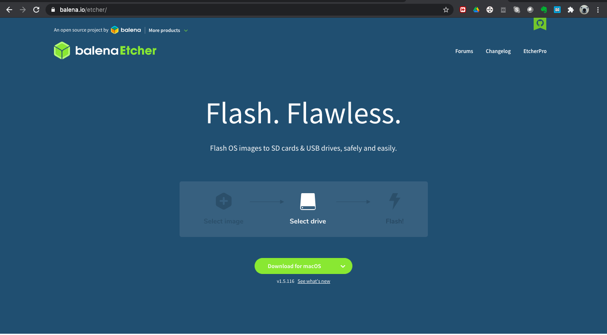

   

4. 打开Etcher，选择下载好的Ubuntu镜像和用来安装Ubuntu镜像的USB。注意看Target name和size，不要选错了Mac的硬盘（如果你选了一个大容量的存储设备的话Etcher会提醒你的，此时就要注意检查）。

   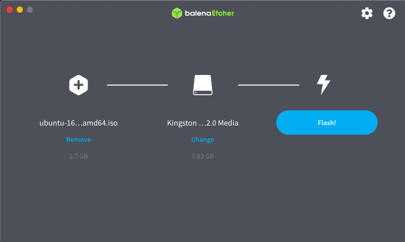

   

5. 点击**Flash！**,等待完成。完成后Etcher会提示成功烧录，此时你有可能看到Mac弹出USB不可读的提示信息，先不用管它，什么都不要点。打开Terminal，输入`diskutil list` 看哪个是你的USB。然后在Terminal输入`diskutil eject /dev/diskN`把*diskN*换成和USB对应的盘。

   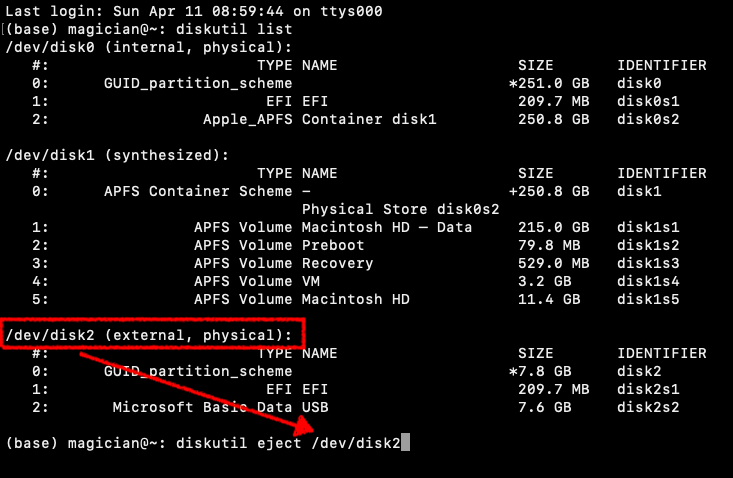

   

6. 成功弹出USB以后，点击**ignore**。【1.2】完成。

这个时候你可以顺便查看一下自己电脑RAM的大小（点击屏幕左上角的苹果，选择**About This Mac**）。这个在后面给Ubuntu设置Swap Space的时候会用到。我的是8GB。

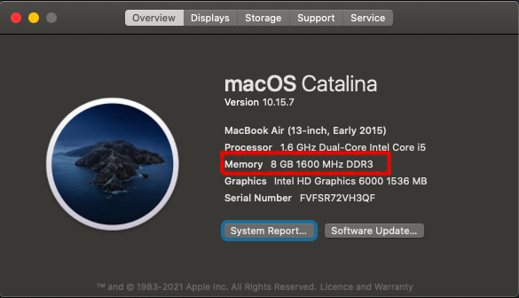

## 【2】安装Ubuntu

（步骤【2】安装过程中的截图我可能在格式化U盘的时候不小心清除了，所以用的是原教程里面的图和加上了自己的注释。）

### 【2.1】进入Ubuntu

1. 关机，然后插入烧录了Ubuntu镜像的USB（注意先不要插移动硬盘）

2. 摁下开机键的同时，长摁住Option键，直到以下页面出现，选择右边黄色的EFI Boot选项：

   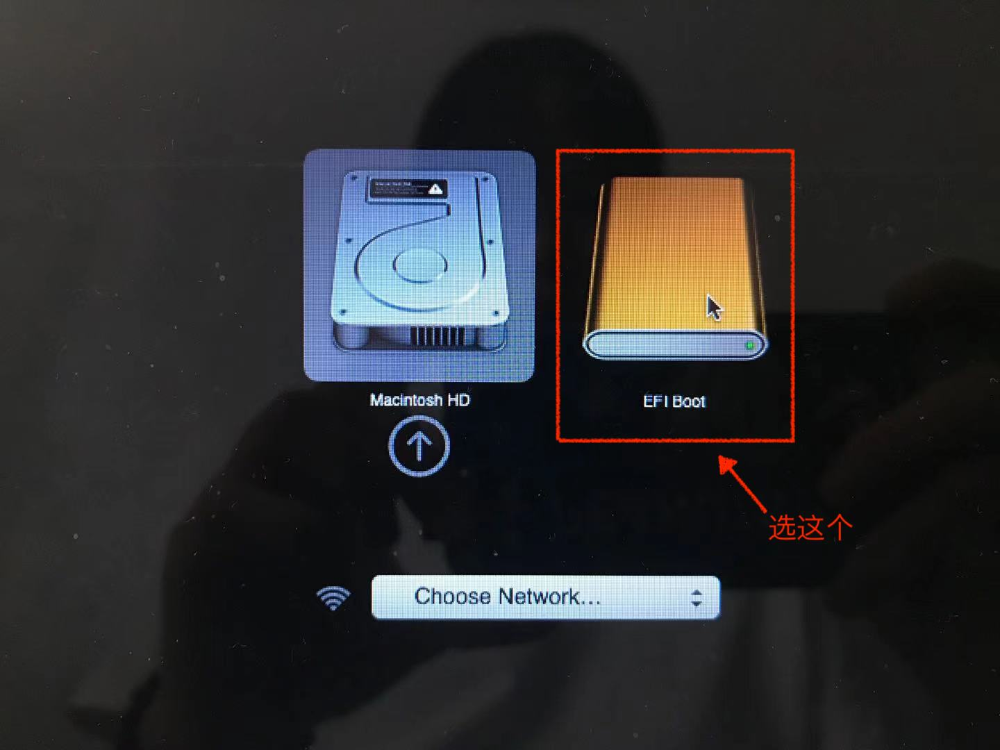

   

   

3. 进入菜单后选择第一个选项"Try Ubuntu withou Installing"

### 【2.2】准备移动硬盘

1. 进入Ubuntu后，插入移动硬盘，并打开GParted

   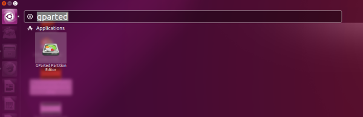

   

2. 在GParted中，点击右上角的方框选择你的移动硬盘（再次注意不要选错了你的Mac硬盘）。把移动硬盘中，**除了UbuntuBootLoader以外**的所有分区都删掉。例如说，我要删掉的分区就有一个标记着*EFI*的fat32格式分区，还有一个标记着*EmptyDrive*的hfs+格式分区。要删除一个分区，鼠标点击该分区，然后点左上方的红色圆圈斜杠图标，该分区就会出现在等待删除的序列中。

   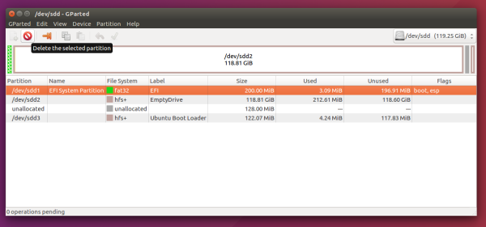

   

   注：如果你的分区中出现了一把小钥匙的图标，说明该分区被锁住了。这是因为这个文件系统已经挂载（mounted），要把它卸载下来（Unmount）。可以右键点击（在Mac接触板上两只手指同时点），然后选择**Unmount**。如果Unmount的选项变成了灰色不给选的话，就Ctrl+Alt+T打开Terminal，然后在上面输入`sudo umount /dev/sdNk` （把sdNk换成你要卸载的文件系统对应的位置，例如此处可以是`sudo umount /dev/sdd2`。如果你不知道它的位置的话，可以在GParted最左边一列*Partition*中看到，或者输入指令`lsblk`查看）。

   另注：如果你要复制粘贴到Terminal的话，用Ctrl+c复制，然后在Terminal用Ctrl+Shift+v粘贴。

3. 选择好所有要删除的分区后，点击上方绿色的钩，实施操作

   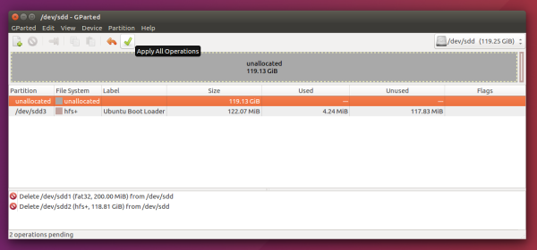

4. 分区删除后，你的移动硬盘就只剩下UbuntuBootLoader和一个*unallocated*的区域。下面我们来新增两个分区（点击**Partition** -> **new**，填好设置后点**Add**）:

   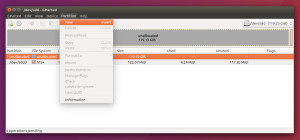

* Swap 分区

  * New Size: 8192 MiB（跟你电脑的RAM一样大或者稍大一点）
  * Created as: Primary Partition（有别的教程显示要用Logical，但是我在这里没法选所以就没改它，也安装成功了，使用正常）
  * File system: linux-swap

  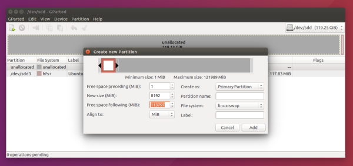

  

* Root分区

  * New Size: 剩下的全部空间（除非你想多分几个区）
  * Created as: Primary Partition
  * File system: ext4
  * Label: 爱写啥写啥
  
  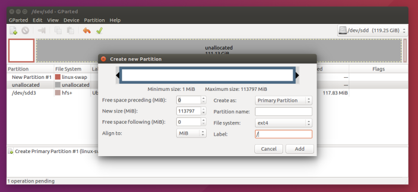

6. 点击上方绿色的钩，应用更改

7. 记住Root分区的分区名（Partition），例如说/dev/sdd2

8. 关掉GParted

注： 想尝试其它分区模式的朋友，可以参考[这篇知乎专栏文章](https://zhuanlan.zhihu.com/p/35294113)，里面有更详细的解释。

### 【2.3】安装Ubuntu

1. （可选）链接Wifi

2. 双击主屏幕左上角的"Install Ubuntu"

3. 选择语言

4. 选择安装项（注：如果你没有开Wifi的话，第一项下载更新会变得不可选。但也没有关系，可以安装完再下载更新，只是说时间可能会长一些。），点**Continue**

   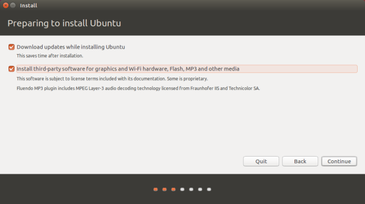

   

5. 因为要安装在移动硬盘上，所以要选择**Something else**：

   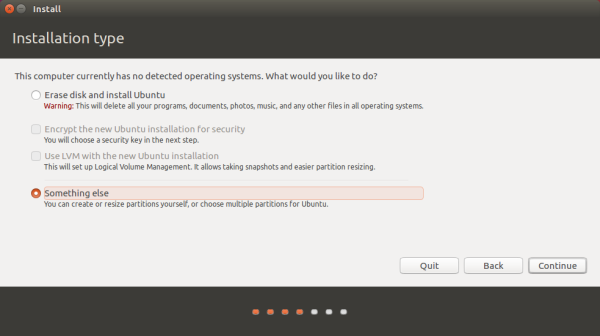

   

6. 找到你刚才设置的*ext4格式*的分区（检查一下分区名和空间大小是对的），点它。

   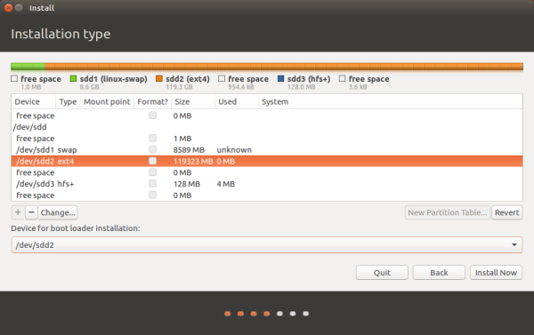

   

7. 选择**Change**，然后按下图设置：

   * Size：不用改
   * Use as: Ext4 journaling file system
   * 选Format the partition
   * Mount point: / （主分区root）

   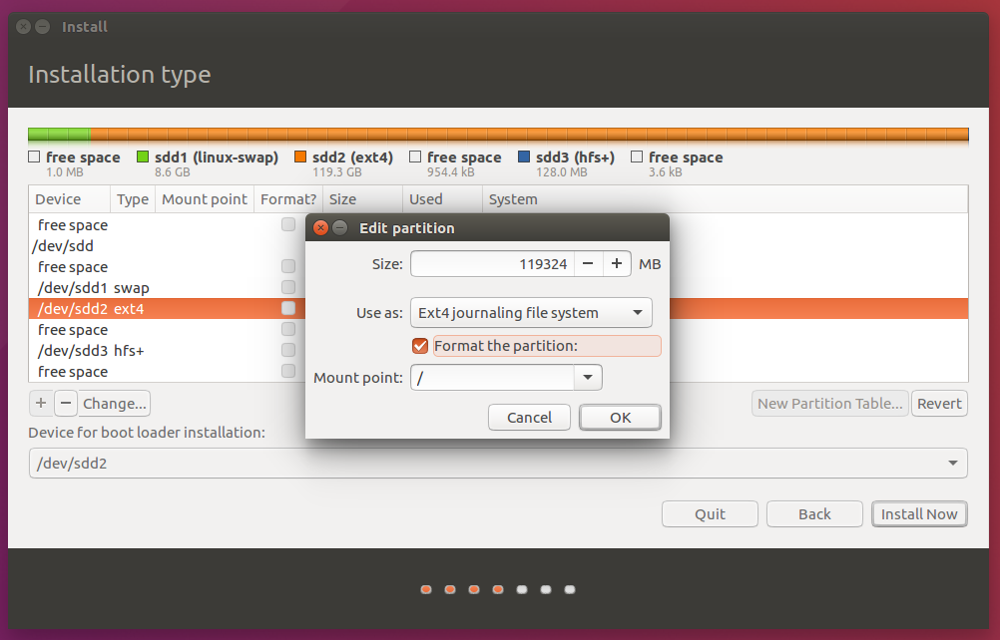

   

8. 在下方"Device for boot loader installation"，选这一个ext4格式的分区（注意不要选了整个/dev/sdd，因为我们还要留下一个UbuntuBootLoader的区域在下一步安装启动项）。例如此处选择的是/dev/sdd2

   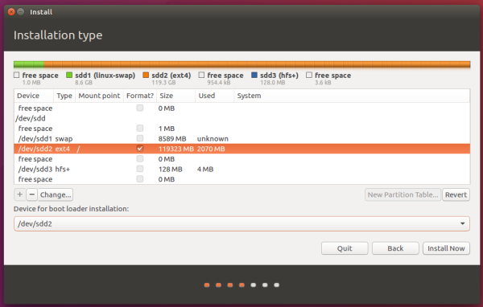

9. 点击**Install now**开始安装，等个大概10~20分钟。
10. 安装结束后，选择**Continue testing**，我们要继续设置开机启动项。

## 【3】设置开机启动项

### 【3.1】Ubuntu中的设置

现在Ubuntu已经装到移动硬盘里面啦~但是开机的时候它不会出现，因为Mac要识别这个为bootable的话，它还需要一个EFI boot loader。所以我们要在Ubuntu里面创建一个boot.efi文件。

1. Ctrl+Alt+T打开Terminal
2. 输入以下命令，把sdNk换成你在【2.2】中设置成ext4的分区名，例如我的是sdd2：

` sudo mount /dev/sdNk /mnt`

3. 然后输入以下指令，挂载几个其它的路径：

`for i in /dev /dev/pts /proc /sys /run; do sudo mount -B $i /mnt$i; done`

4. 把root路径改成/mnt，这样Terminal的bash session就是在Ubuntu里面运行了：

`sudo chroot /mnt`

5. 设置GNU GRUB（GRand Unified Bootloader）:

`grub-mkconfig -o boot/grub/grub.cfg`

6. 把它保存到一个boot.efi文件中:

`grub-mkstandalone -o boot.efi -d usr/lib/grub/x86_64-efi -O x86_64-efi --compress=xz boot/grub/grub.cfg`

7. 退出：

`exit`

8. 所有的指令如下图：

   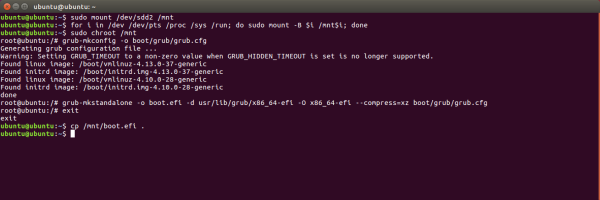

9. 把boot.efi文件拷贝到这个Ubuntu的live session中：

`cp /mnt/boot.efi /home/ubuntu`

10. 然后在home文件夹下找到boot.efi文件，通过邮件发送给自己，或者保存在你的云盘上
11. 点屏幕右上角的齿轮状图标，关闭Ubuntu。此时电脑会提示让你把装机的USB（就是烧录了镜像的USB，不是你的移动硬盘！）。拔除之后摁回车就可以。

### 【3.2】关闭Mac系统的SIP（System Integrity Protection）

如果你的Mac系统是El Capitan(10.11)或以上（一般都是，毕竟现在都出到Big Sur(11.X)了），Mac系统有额外的安全设置SIP（System Integrity Protection），我们需要先关掉它。

1. 关机之后重启电脑同时摁住Command+R直到苹果的标志出现，进入恢复模式（Recovery Mode）。点击你的用户名，输入密码。

   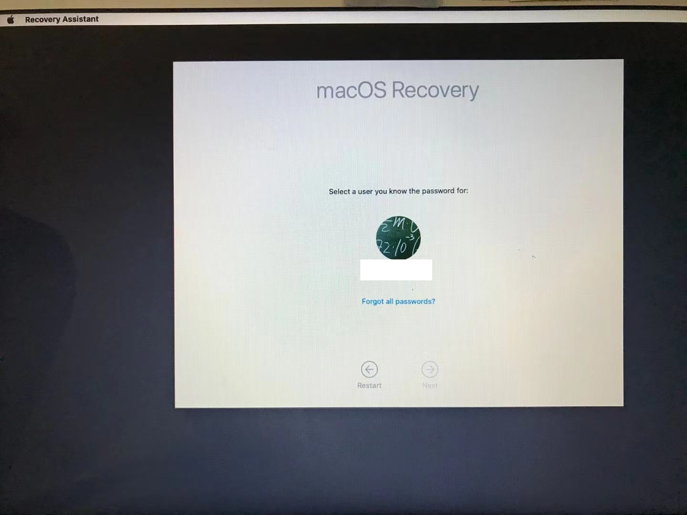

   

2. 屏幕上方，点击**Utilities** -> **Terminal**

   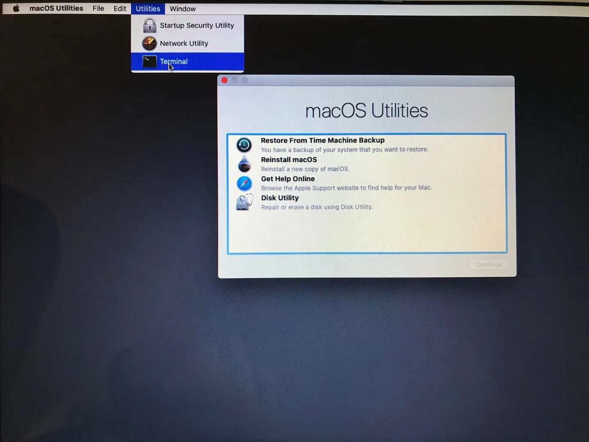

   

3. 在Terminal里面输入：

`csrutil disable`

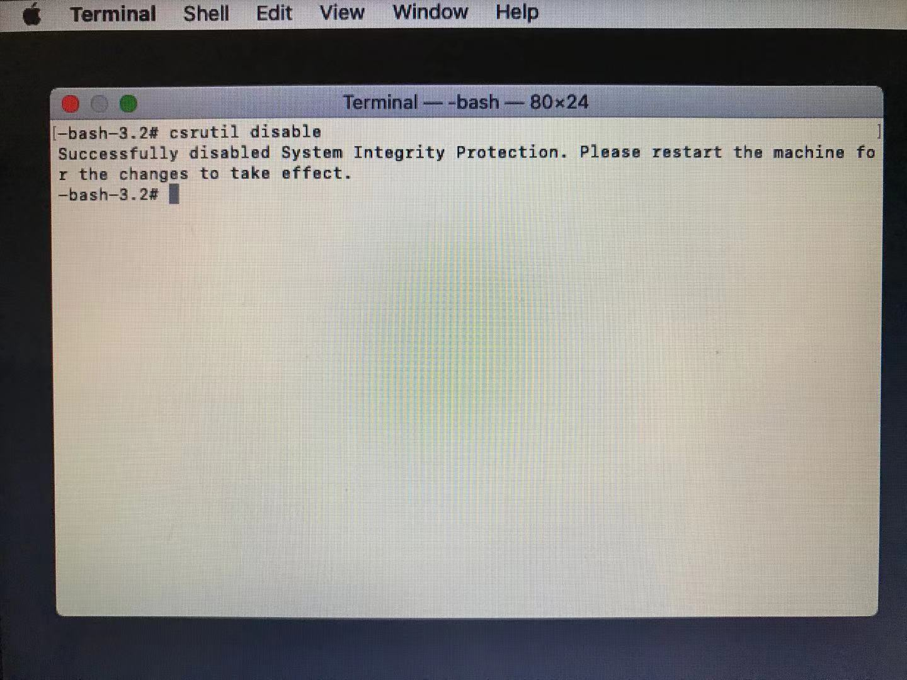

4. 摁回车，然后点**Restart**重启电脑。

   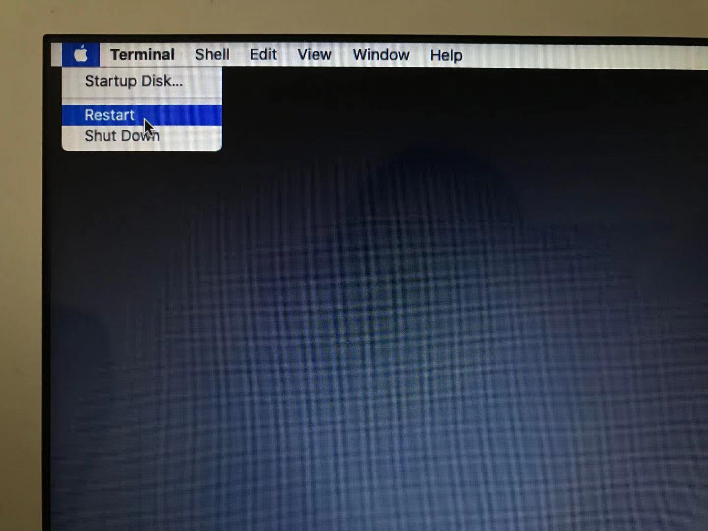

注：重启时如果看到写着grub的黑色屏幕，输入exit然后摁回车就好

### 【3.3】在移动硬盘中安装启动项

1. 打开Terminal
2. 插入刚安装好Ubuntu的移动硬盘，输入：

`cd /Volumes/UbuntuBootLoader/`

​	注：在Mac的Terminal复制粘贴不需要加shift，直接Command+c（复制）或者Command+v（粘贴）就好

3. 把下面四行命令一行一行地输进去：

`sudo mkdir System mach kernel`
`cd System`
`sudo mkdir -p Library/CoreServices`
`cd Library/CoreServices`

4. 从邮件/云盘上把你刚才保存的boot.efi文件下载下来，放在/Downloads文件夹
5. 回到Terminal中输入以下指令：

`sudo cp ~/Downloads/boot.efi ./`

7. 现在我们要创建SystemVersion.plist文件，可以点击[这个链接](https://gist.github.com/florisvb/23f7da2e613a45e1fbd81d2d7ee01a7a)下载到/Downloads，如果链接打不开的话，我会把文件以附件形式上传。
8. 回到刚才的Terminal，把下载下来的plist文件保存到存放boot.efi的路径(*/Volumes/UbuntuBootLoader/System/Library/CoreServices*):

`sudo cp ~/Downloads/SystemVersion.plist ./`

9. 所有的指令如下图：

   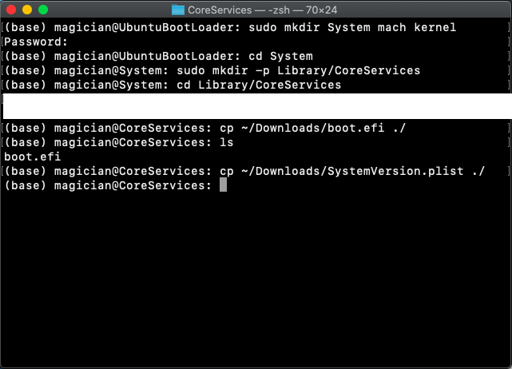

10. 打开Disk Utility（**Go** -> **Utilities** -> **Disk Utility**）,查看你的UbuntuBootLoader的设备编号。或者你也可以在Terminal输入`disktutil list`查看。在我的是disk2s3。

    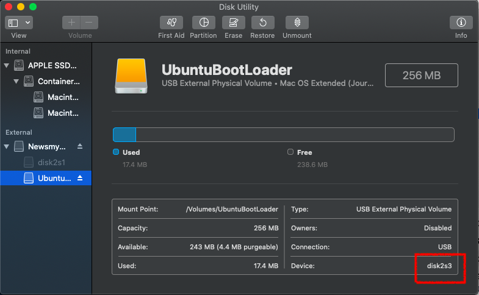

    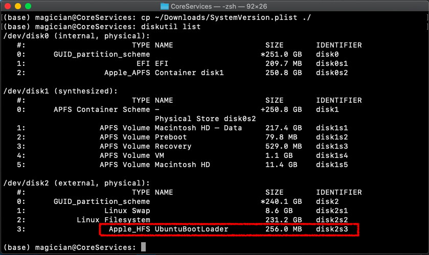

    

11. 最后一步，在Terminal中输入：

`sudo bless --device /dev/diskNsK --setBoot`

把diskNsK换成第10步中查到的设备编号。

### 【3.4】重启Mac系统的SIP（完结撒花✿✿ヽ(°▽°)ノ✿）

和【3.2】一样，把`csrutil disable` 换成`csrutil enable`即可。

恭喜你，完成所有安装啦！以后只要不插入移动硬盘，开机的时候就会自动导入到MacOS中。要进入Linux系统，只需插入了移动硬盘后，在开机的同时摁住Option键进入boot manager，然后选择Ubuntu系统就好。开玩~

## 其它问题

Q1. 开机出现grub的提示？

输入exit，然后摁回车。

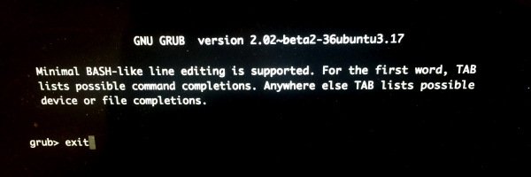

如果想一劳永逸地解决这个问题，进入MacOS以后，点左上方的苹果，选择**System Preferences** -> **Startup Disk**。进去之后点左下角的锁解锁，然后选择你的Macintosh。重启之后就再也不会见到grub了。

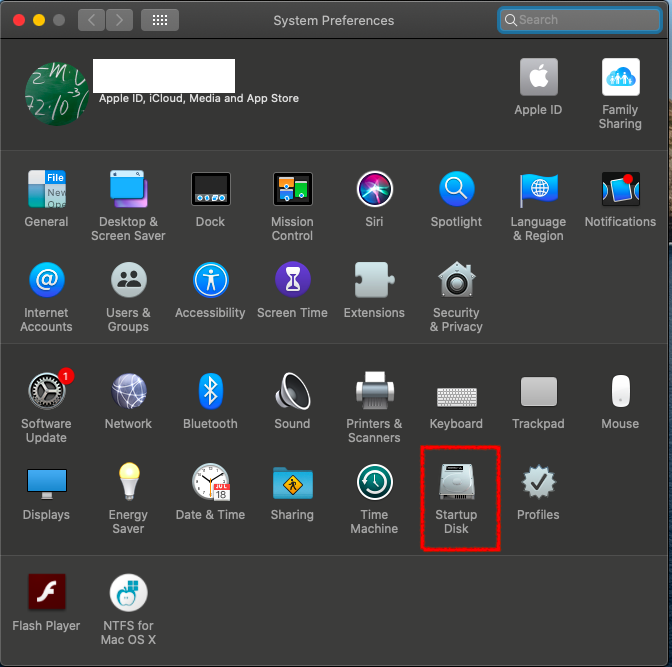

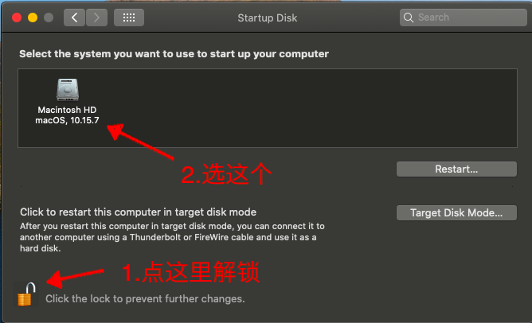

### 参考链接：

* https://florisvanbreugel.wordpress.com/2018/03/23/installing-ubuntu-on-an-external-ssd-drive-on-a-macbook/
* https://business.tutsplus.com/tutorials/how-to-create-a-bootable-ubuntu-usb-drive-for-mac-in-os-x--cms-21253 
* https://zhuanlan.zhihu.com/p/35294113
* https://askubuntu.com/questions/229552/grub-rescue-after-installing-ubuntu-on-a-external-hdd-from-usb

